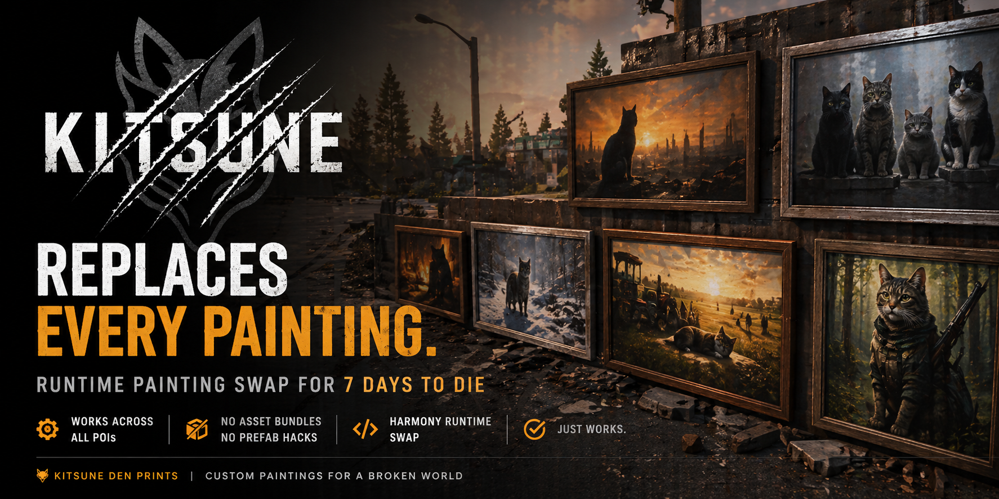

<p align="center">
  <a href="https://prints.kitsuneden.net">
    
  </a>
</p>

<p align="center">
  <a href="https://prints.kitsuneden.net"></a>
  <a href="https://prints.kitsuneden.net/app"></a>
  <a href="https://prints.kitsuneden.net/KitsunePrints-DIY-Kit.zip"></a>
  <a href="https://paint.kitsuneden.net"></a>
</p>

<p align="center">
  
  
  
  
</p>

# 🐱 KitsunePrints

A web-based custom picture pack creator for **7 Days to Die V2.6**. Upload your art, drop it into vanilla painting / poster / canvas / frame slots across **69 swap targets**, download a ready-to-install modlet. Every painting in every POI ~ plus snack posters, movie posters, picture frames, hidden-safe disguises ~ now wears your art. No Unity, no asset bundles, no prefab hacks. A Harmony runtime swap does the heavy lifting at world load.

## What it does

1. **Pick a category** ~ tabbed builder with a live `X/Y filled` badge per category and a sticky download bar always within reach.
2. **Upload an image per slot** you want to override. Skipped slots stay vanilla.
3. **Crop** ~ aspect-locked crop matched per slot kind (3:4 portraits, 1:1 abstracts, atlas-tile aspects for movie posters / canvases / picture frames).
4. **Frame style** ~ portraits + picture frames each take a wood/metal preset (dark wood, light wood, gold gilt, silver, matte black, ornate gold). Portraits paint the preset into a UV strip wrapping the 3D frame mesh; picture frames apply it as a multiply-blend tint over the wood-frame zone of the atlas.
5. **Title each slot** ~ shows up as `Print: <your title>` in the creative menu, searchable under "print" or any keyword.
6. **Download** ~ a complete modlet zip with the shared `KitsunePrints.dll`, composed textures (per-slot for portraits/abstracts/decor; per-shared-atlas for movie posters / canvases / picture frames), generated `blocks.xml` (with optional inline `CanPickup` patches for ~100 vanilla decor blocks) / `recipes.xml` / `Localization.txt`, ItemIcons, and a `picture_pack.json` map. Drop into `<7DTD>/Mods/`, restart, done.

The full pack state (slot titles, frame choices, pack info) auto-saves to your browser's localStorage so you don't lose work on reload. Images are session-only ~ re-upload them when you come back.

## Slot categories (69 total)

| Category | Slots | What they cover |
|---|---|---|
| **Portraits** | 6 | 1×1 backer paintings (Ben, Lorien, Derek, Noah, Duke, Ken) ~ 3:4 portrait + wood frame strip |
| **Abstracts** | 4 | Each drives both 2×2 and 3×2 painting blocks per design (8 vanilla blocks total) |
| **Movie Posters** | 4 | Tiles of the shared `posterMovie` 1024×1024 atlas. Theater variants ride along ~ replacing one re-skins both blocks. |
| **Misc Decor** | 5 | Calendar, Pistol/Rifle Blueprints, Target Posters 1+2 |
| **Snack Posters** | 17 | The full `snackPosters_d` atlas wall ~ Thick Nick's, Goblin-O's, Bretzels, Eye Candy, Skull Crushers, Nachios Beef + Ranch, Health Bar (wide), Hackers, Prime, Atom, Nerd Tats, Ramen, Jail Breakers, Fort Bites, Oops + Oops Classic |
| **Picture Frames** | 23 | Per-letter slots across 8 shared atlases (`pictureFramed`, `pictureFramed2..8`). Hidden-safe variants re-skin automatically since they extend their non-safe twin. |
| **Canvases** | 10 | Per-letter slots across 2 shared atlases (`pictureCanvas1`, `pictureCanvas2`) |

## Press-E pickup (default on)

Every pack ships with a one-line patch adding `<property name="CanPickup" value="true"/>` to ~100 vanilla decor blocks (all 7 slot categories above + their hidden-safe disguises). Walk up to any vanilla painting, snack poster, picture frame, or wall-safe-disguised-as-painting in a POI ~ press E ~ it lands in your inventory. Place it back from there. No tool, no recipe, no fuss. Toggle off in the Pack Info tab if you'd rather POIs stayed undismantleable.

The pickup patches are inlined into `Config/blocks.xml` (the canonical filename 7DTD's `XmlPatcher` reliably loads) ~ a custom `pickup.xml` was tried in v0.5.x and silently dropped by the loader, so v0.8.2 moved them.

## How it works

The included **`KitsunePrints.dll`** is a single Harmony patch on `World.LoadWorld` postfix. At runtime it:

1. Reads `Config/picture_pack.json` for a `vanilla_material → texture_filename` map (or falls back to bundled defaults).
2. Walks `Resources.FindObjectsOfTypeAll<Material>()` to find each vanilla material by name.
3. Replaces `_MainTex` (and `_BaseMap` for URP) with the user's image, resets UV scale/offset to `(1,1)/(0,0)` so atlas-tile materials display the full swapped image instead of a tiny crop.

The discovery and swap calls go through **`IMaterialFinder`** + **`IMaterialSwap`** adapter interfaces, so future game versions (URP/HDRP migration in v3.0/v4.0, Addressables behavior changes, shader property renames) can be handled by swapping in a different implementation without touching the sweep loop. See [`docs/migration-plan.md`](docs/migration-plan.md) for the full v3.x → v4.x risk assessment.

This is **shared infrastructure across every pack** ~ per-pack only the textures + JSON config + ModInfo + generated XMLs vary. The same DLL works for every pack created by the tool.

## Atlas-tile compositing

Some categories (movie posters, picture frames, canvases) sample tiles from a shared atlas in vanilla ~ multiple block prefabs all use one atlas, each with its own mesh-UV-defined sub-region. For these, the composer:

1. Loads the vanilla atlas as a base layer (preserves regions sampled by mesh UVs we don't write to)
2. For picture-frame atlases: multiply-blends the chosen frame tint over the top 55% wood-frame zone (wood grain preserved, just recolored)
3. Pastes each filled slot's user image into its tile rectangle (rects derived empirically from each prefab's LOD0 mesh UVs ~ see [`scripts/read_picture_frame_uvs.py`](scripts/read_picture_frame_uvs.py) and [`scripts/read_movie_poster_uvs.py`](scripts/read_movie_poster_uvs.py))

Result: one composite texture file per shared material, with each prefab automatically rendering the right sub-region thanks to vanilla's mesh UVs.

## DIY / offline

If you'd rather skip the web tool, grab [`KitsunePrints-DIY-Kit.zip`](https://prints.kitsuneden.net/KitsunePrints-DIY-Kit.zip) ~ Python script + DLL + frame textures + 11 vanilla atlases (~46 MB unzipped) + example config. `pip install Pillow`, edit a JSON, drop your images, run `python make_pack.py example_pack/`, get a modlet out. The DIY kit ships every category the web tool ships ~ same 69 slots, same atlas-tile compositing, same press-E pickup.

## Dependencies

- 7 Days to Die V2.6 (vanilla material naming, atlas layout, and prefab mesh UVs are version-specific; see [migration plan](docs/migration-plan.md) for v3.x/v4.x outlook)
- EAC must be disabled (any DLL-shipping mod requires this)
- No third-party mod dependencies ~ the Harmony patch is self-contained

## Tech stack

- Vite + React 19 + TypeScript
- Tailwind CSS v4
- JSZip + react-easy-crop (client-side composition + zip generation, no server-side image processing)
- vitest (35 unit tests gating CI)
- Express (serves the static build + small build-counter API)
- Pillow (Python, DIY-kit-side image composition)
- Harmony / C# (DLL patch ~ source in the [KitsunePrints mod repo](https://github.com/Kitsune-Den/KitsunePrints))
- UnityPy (one-off vanilla atlas + mesh UV extraction; see `scripts/extract_vanilla_refs.py`)

## Project structure

```
src/
  pages/                 # IntroPage, BuilderPage (tabbed grid + sticky download bar), TermsPage
  components/            # SlotCard, FramePresetPicker, CropDialog, PackMetaForm, DownloadButton
  utils/
    buildModlet.ts       # zip orchestration, XML rendering, pickup patch inlining (35 unit tests cover the helpers)
    buildModlet.test.ts
    composer.ts          # composePortrait / composeAbstract / composeAtlas / composeIcon
    pickupBlocks.ts      # the ~100-block PICKUP_BLOCKS list
    persistence.ts       # localStorage save/load for slot config + pack meta
  types/
    slots.ts             # SLOTS list + ATLAS_SOURCES + FRAME_PRESETS + isDefaultPackMeta
    slots.test.ts
public/
  reference/             # KitsunePrints.dll (bundled into every downloaded pack)
  frames/                # 6 frame texture presets, 256×1024 each
  vanilla/               # extracted vanilla reference thumbnails + atlas base layers used by the composer
  screenshots/           # in-POI hero + tool screenshots
  social-print.png       # OG / Twitter card
  discord.png            # Kitsune Den Discord callout banner
docs/
  migration-plan.md      # §3.4 KitsunePrints addendum to the Kitsune-Den migration handbook
scripts/
  make_pack.py           # standalone CLI builder (DIY kit's main script)
  build_diy_kit.py       # packages script + DLL + frames + 11 vanilla atlases into the downloadable zip
  extract_vanilla_refs.py    # one-off UnityPy extraction of reference thumbs + atlas base layers
  read_picture_frame_uvs.py  # one-off mesh UV reader for picture frame tile rects
  read_movie_poster_uvs.py   # one-off mesh UV reader for movie poster tile rects
  example_pack/          # example config for the DIY kit
  kitsuneprints.service  # systemd user unit for the VPS
.github/workflows/
  deploy.yml             # CI gates on `npm run test`, then auto-deploys to prints.kitsuneden.net
```

## Local development

```sh
npm install
npm run dev              # http://localhost:5173
npm run test             # vitest run (35 tests)
npm run build            # tsc -b && vite build → dist/
node server.cjs          # serve the build on http://localhost:9003
```

DIY kit changes:

```sh
python scripts/build_diy_kit.py     # rebuild public/KitsunePrints-DIY-Kit.zip
```

DLL changes (different repo, [Kitsune-Den/KitsunePrints](https://github.com/Kitsune-Den/KitsunePrints)):

```sh
cd KitsunePrints/Harmony && dotnet build -c Release
cp ../KitsunePrints.dll <web-tool-repo>/public/reference/KitsunePrints.dll
```

## Deploy

Pushes to `main` run unit tests, then auto-deploy via GitHub Actions to the DreamHost VPS at `prints.kitsuneden.net`. See [`scripts/kitsuneprints.service`](scripts/kitsuneprints.service) and [`.github/workflows/deploy.yml`](.github/workflows/deploy.yml) for the systemd + workflow setup.

Required GitHub secrets: `VPS_HOST`, `VPS_USER`, `VPS_SSH_KEY`.

## Privacy

Your images **never leave your browser.** Composition, icon generation, zip packaging ~ all client-side canvas + JSZip. The only server-side ping is an anonymous fire-and-forget `POST /api/built` after a successful download, logging only a timestamp and slot count. Slot titles, frame choices, and pack metadata also live in your browser's localStorage and never go anywhere else. See [Terms & Privacy](https://prints.kitsuneden.net/terms).

## Roadmap (post-v0.8)

Architecture is now ready for almost any vanilla wall-art expansion ~ adding a new category to the web tool is mostly: identify the vanilla material(s), add an entry to `SLOTS` in [`src/types/slots.ts`](src/types/slots.ts), and run `extract_vanilla_refs.py` for reference thumbs. Categories under consideration:

- 🪧 **Trader signage** ~ traderBobSign, traderJoelSign, etc., plus the storeSigns01/02_d atlases (Shotgun Messiah, Crackabook, Mo Power, etc.)
- 🪪 **Street + yard signs** ~ where they make sense (most are functional, less interesting to re-skin)
- 🎨 **Cat / dog / sparky standalone posters** ~ slot scaffolding identified, materials need a deeper prefab walk
- 🪟 **Wallpaper / floor tiles** ~ bigger lift; same Harmony pattern works in principle
- 🔧 **Slot pre-tour** ~ visual gallery on the front page showing every replaceable slot before visitors hit the builder

Tracked issues: [#1 (place vanilla paintings in survival)](https://github.com/Kitsune-Den/KitsunePrints/issues/1) ~ shipped via the press-E pickup feature; [#2 (custom inventory icons for picked-up vanilla blocks)](https://github.com/Kitsune-Den/KitsunePrints/issues/2) ~ tracked, not yet fixed.

If a specific block or sign you'd love to skin isn't in the slot list, [open an issue](https://github.com/Kitsune-Den/KitsunePrints/issues) with its name and we'll see if it's swap-friendly.

## Part of the Kitsune ecosystem

- [KitsuneDen](https://kitsuneden.net) ~ home server hub
- [KitsunePaint](https://paint.kitsuneden.net) ~ custom paint pack creator
- **KitsunePrints** ~ custom picture pack creator (you are here)
- [Join the Discord](https://kitsuneden.net/discord) ~ get support, share builds, suggest new slots

---

<p align="center"><sub>Built by Ada · Powered by the Skulk</sub></p>
